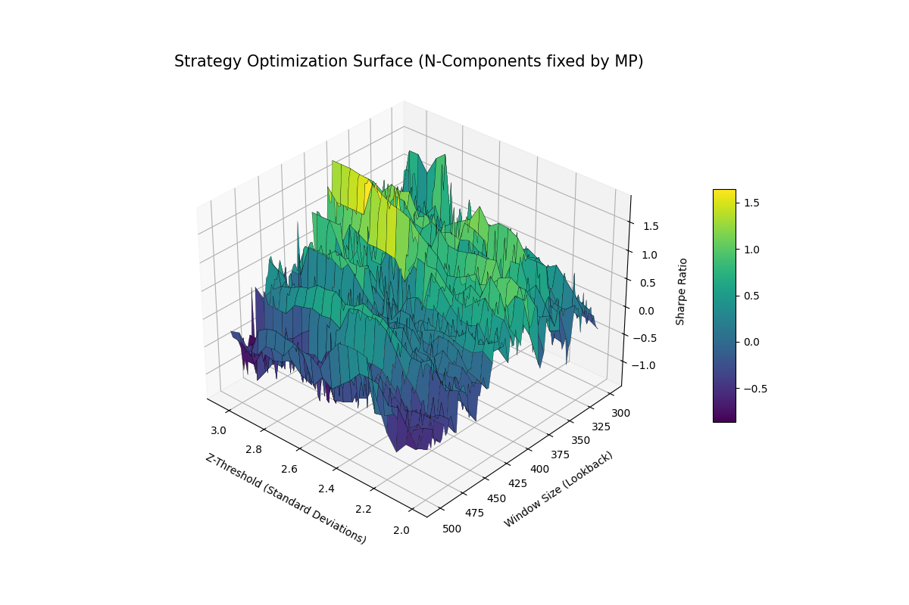

# PCA Statistical Arbitrage Strategy (v2)

**What it is:** A mean-reversion statistical arbitrage strategy on a basket of technology equities using Principal Component Analysis (PCA) to isolate idiosyncratic alpha from common market factors.

## Methodology

The strategy operates on the premise that equity returns are driven by a small number of common factors (eigen-portfolios) and a residual component unique to each stock. When this residual component (the "spread") deviates significantly from its mean, it is expected to revert.

1.  **Factor Extraction:** PCA is applied to an $N \times T$ log-return matrix to identify the top $K$ "market factors" (eigen-portfolios).
2.  **Beta Estimation:** Each stock's returns are regressed against these $K$ factors to determine its sensitivity (Betas).
3.  **Signal Generation:**
    *   **Residual Calculation:** $Residual = StockReturn - (Beta \times FactorReturns)$.
    *   **Spread:** The cumulative sum of these residuals (representing the idiosyncratic price path).
    *   **Z-Score:** The Z-score of the spread is calculated over a rolling window.
4.  **Execution:**
    *   **Entry:** Buy the stock and sell the factor-weighted hedge basket if $Z < -threshold$ (oversold). Sell the stock and buy the basket if $Z > threshold$ (overbought).
    *   **Exit:** Positions are closed when the Z-score returns to a neutral range (defined by an exit threshold).

## Results

The strategy was backtested using `vectorbt` on a basket of 10 major technology tickers (`NVDA`, `AMD`, `TSM`, `MU`, `MSFT`, `ADBE`, `CRM`, `NOW`, `AAPL`, `GOOGL`) over a 5-year period.

*   **Transaction Costs:** Assumed 10bps (0.001) per trade.
*   **Slippage:** Assumed 5bps (0.0005) per trade.
*   **Performance:** Hyper-parameter tuning identified a robust region for the **Sharpe Ratio between 1.2 and 1.6** at higher Z-thresholds (>2.6) and larger lookback windows (>350 days).

### Optimization Surface
The following heatmap (from `v2/Figure_1.png`) illustrates the sensitivity of the Sharpe Ratio to the PCA window size and entry Z-threshold:



## How to Run

### Dependencies
Ensure you have the required libraries installed:
```bash
pip install numpy pandas scikit-learn vectorbt yfinance questionary tabulate matplotlib
```

### Execution
1.  **Data Acquisition:** Fetch the latest 5-year historical data for the basket.
    ```bash
    python v2/get_new_data.py
    ```
2.  **Backtest Single Run:** Execute the strategy with default optimized parameters (`window=392`, `Z=2.65`).
    ```bash
    python v2/main.py
    ```
3.  **Hyper-Parameter Tuning:** Run a grid search across window sizes and Z-thresholds to generate `output.csv`.
    ```bash
    python v2/hyper_parameter_tuning.py
    ```
4.  **Visualization:** Generate the 3D optimization surface from existing results.
    ```bash
    python v2/data_vis.py
    ```
